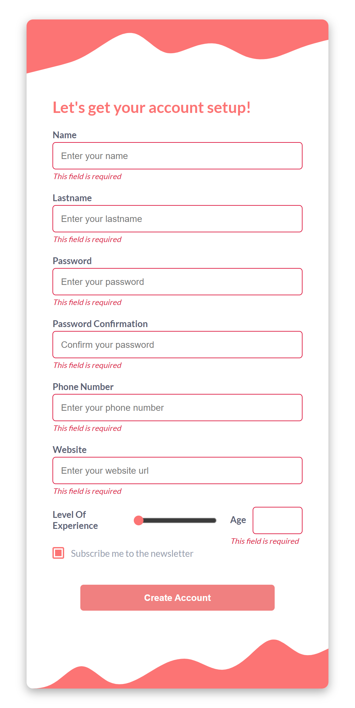
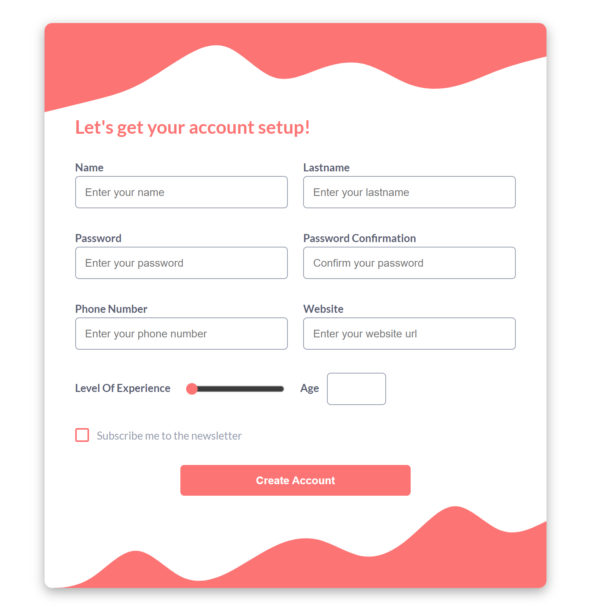

# Homework Week 1 - Responsive Form and Konami Code

## Description

The homework consists of two phases, the first one is about creating a responsive form and validating its fields using JavaScript, if the data in the fields is correct then it should be printed in the console otherwise the corresponding error messages should appear on the form fields, the second phase is about adding a "konami code" functionality to the page containing the form, which will show an animated gif in the center of the page when the user presses the correct sequence of keys.

## Visuals

**Screenshot Mobile**

**Screenshot Tablet**

**Screenshot Desktop**

## Live Site

## Built With

- Semantic HTML5 markup
- CSS Flexbox
- Media Queries
- Desktop-First approach
- CSS Custom Properties
- JavaScript Basics
- Basic Event Handling
- Basic DOM Manipulation

## Konami Code

magic

## UI Inspiration

[Behance UI Design](https://www.behance.net/gallery/134281413/UIUX-Form-Case-Study?tracking_source=search_projects%7Csignup+form+web+design)
